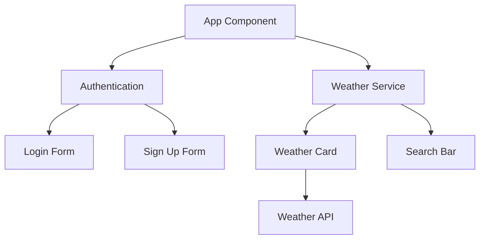

# SkySync Weather Application 🌦️

<div align="center">


[](https://phenomenal-syrniki-57162b.netlify.app)
[](https://www.typescriptlang.org/)
[](https://reactjs.org/)
[](https://tailwindcss.com/)
[](https://vitejs.dev/)

[View Demo](https://phenomenal-syrniki-57162b.netlify.app) • [Report Bug](https://github.com/yourusername/skysync/issues) • [Request Feature](https://github.com/yourusername/skysync/issues)

</div>

## 👋 Connect With Me

<div align="center">
  
[](https://github.com/mouryas-aiml)
[](https://www.linkedin.com/in/mourya-s-4518b9296)
[](https://www.facebook.com/mouryagowda.s?mibextid=ZbWKwL)
[](https://x.com/Mr_Mourya_Gowda?s=09)
[](https://www.instagram.com/_mourya__gowda_/profilecard/?igsh=dHZ4NzRtdHpzdGE5)
[](https://discord.gg/mourya_gowda)
[](https://youtube.com/@mouryas_streamline.x?si=tt4mv9rmC3qwb2nh)
[](https://www.snapchat.com/add/mourya_gowda19?share_id=H_YsOHgpsr0&locale=en-IN)
[](https://whatsapp.com/channel/0029VadTKY17oQhXeo0FYy0G)

</div>

## 📞 Contact Me

<div align="center">

[](mailto:mouryas@outlook.in)
[](tel:+918762656329)
[](https://maps.app.goo.gl/Ji8CJKizjRofkxGa6?g_st=ac)

</div>

## ✨ Features

<div align="center">

</div>

🌡️ **Real-Time Weather Data**
- Current temperature and conditions
- "Feels like" temperature
- Detailed weather descriptions

🌍 **Location Services**
- Search any location worldwide
- Automatic location detection
- Detailed location information

📊 **Comprehensive Metrics**
- Wind speed and direction
- Humidity levels
- Air quality index (US EPA standards)

🔐 **User Authentication**
- Secure email/password login
- User registration system
- Profile management

🎨 **Beautiful UI/UX**
- Responsive design
- Dark/light mode support
- Smooth animations
- Real-time updates
- 3D Animated Logo
- Background Weather Videos
- Side Menu with User Profile

## 🚀 Quick Start

### Prerequisites

- Node.js 18+ installed
- npm or yarn package manager
- Modern web browser

### Installation

1. Clone the repository
```bash
git clone https://github.com/yourusername/skysync.git
```

2. Navigate to project directory
```bash
cd skysync
```

3. Install dependencies
```bash
npm install
```

4. Create `.env` file and add your WeatherAPI key
```env
VITE_WEATHER_API_KEY=your_api_key_here
```

5. Start the development server
```bash
npm run dev
```

## 🏗️ Architecture

<div align="center">



</div>

## 📁 Project Structure

```
src/
├── components/          # React components
│   ├── BackgroundVideo.tsx
│   ├── LoginForm.tsx
│   ├── Logo3D.tsx
│   ├── SearchBar.tsx
│   ├── SideMenu.tsx
│   ├── SocialLinks.tsx
│   └── WeatherCard.tsx
├── services/           # API services
│   ├── authService.ts
│   └── weatherApi.ts
├── types/             # TypeScript types
│   ├── auth.ts
│   └── weather.ts
└── App.tsx           # Main application
```

## 🛠️ Built With

- **Frontend Framework**: React 18 with TypeScript
- **Styling**: Tailwind CSS
- **Icons**: Lucide React
- **Build Tool**: Vite
- **Weather Data**: WeatherAPI
- **Deployment**: Netlify
- **3D Graphics**: Three.js

## 📸 Screenshots

<div align="center">


</div>

## 🤝 Contributing

1. Fork the repository
2. Create your feature branch
   ```bash
   git checkout -b feature/AmazingFeature
   ```
3. Commit your changes
   ```bash
   git commit -m 'Add some AmazingFeature'
   ```
4. Push to the branch
   ```bash
   git push origin feature/AmazingFeature
   ```
5. Open a Pull Request

## 📄 License

This project is licensed under the MIT License - see the [LICENSE](LICENSE) file for details.

## 🙏 Acknowledgments

- Weather data provided by [WeatherAPI](https://www.weatherapi.com/)
- Icons by [Lucide](https://lucide.dev/)
- UI inspiration from various weather apps
- Background images from [Unsplash](https://unsplash.com/)

---

<div align="center">

Made with ❤️ by [Mourya S]

[⬆ Back to top](#skysync-weather-application-)

</div>